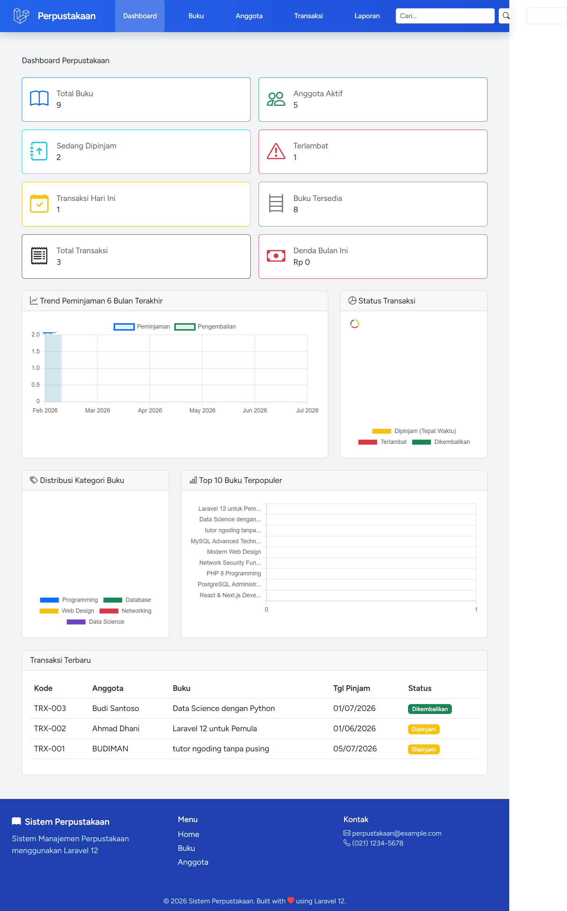
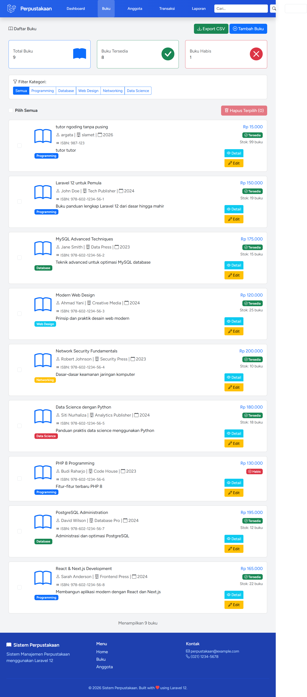
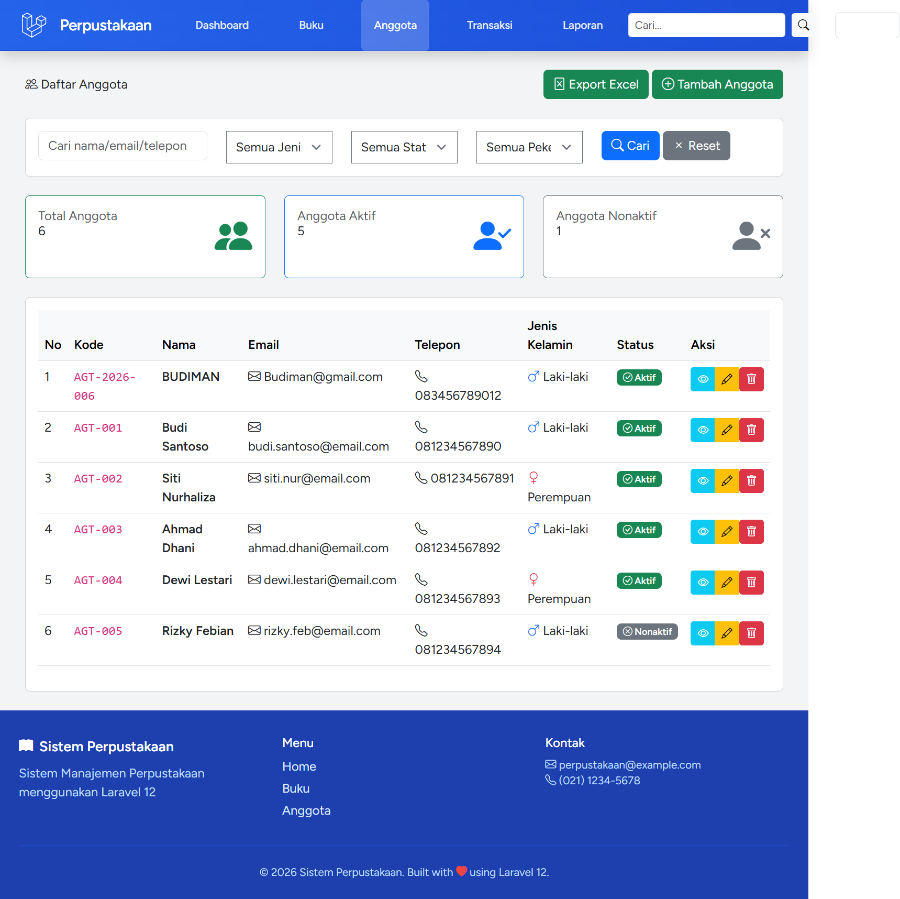
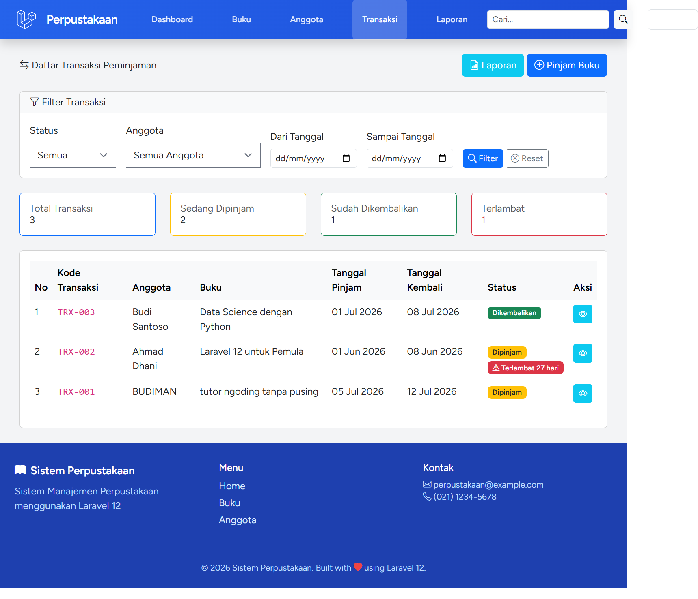
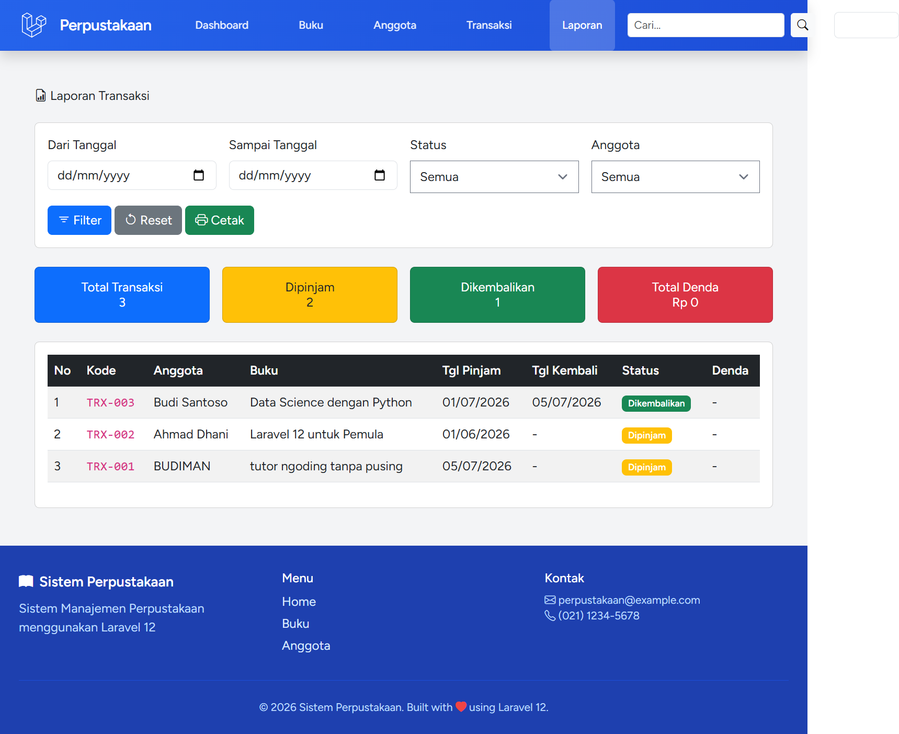

# Sistem Perpustakaan Laravel

Sistem Perpustakaan ini adalah aplikasi manajemen perpustakaan berbasis Laravel yang menyediakan fitur pengelolaan buku, anggota, transaksi peminjaman, dan laporan. Desain UI telah disesuaikan agar tampil modern dengan tema biru dan footer global di setiap halaman.

## Deskripsi Project

Aplikasi ini dibangun untuk membantu pustakawan dan admin bendahara dalam mengelola koleksi buku, anggota perpustakaan, transaksi pinjam/kembali, dan laporan. Aplikasi memanfaatkan Laravel 12, Tailwind CSS, Vite, dan beberapa paket penting seperti `maatwebsite/excel` untuk ekspor Excel dan `barryvdh/laravel-dompdf` untuk export PDF.

## Fitur

- [x] Autentikasi pengguna dengan Laravel Breeze (login, register, profile)
- [x] Dashboard ringkasan statistik buku, anggota, transaksi, denda, dan grafik
- [x] CRUD Buku (Tambah, lihat detail, edit, hapus)
- [x] Filter buku berdasarkan kategori, tahun terbit, dan status ketersediaan
- [x] Ekspor data buku ke Excel
- [x] Bulk delete buku
- [x] CRUD Anggota (Tambah, lihat detail, edit, hapus)
- [x] Kode anggota otomatis saat pendaftaran
- [x] Ekspor data anggota ke Excel
- [x] CRUD Kategori buku
- [x] Manajemen transaksi peminjaman dan pengembalian buku
- [x] Hitung denda keterlambatan otomatis saat pengembalian
- [x] Laporan transaksi dengan filter tanggal, status, dan anggota
- [x] Ekspor laporan transaksi ke PDF
- [x] Pencarian global untuk buku, anggota, dan transaksi
- [x] Tema UI biru dan footer konsisten pada setiap halaman

## Screenshots

Folder screenshot tersedia di `dokumentasi`:

- `dokumentasi/localhost_8000_dashboard.png`
- `dokumentasi/localhost_8000_buku.png`
- `dokumentasi/localhost_8000_anggota.png`
- `dokumentasi/localhost_8000_transaksi.png`
- `dokumentasi/localhost_8000_laporan.png`

Contoh tampilan:











## Instalasi

1. Clone repository:

```bash
git clone <repository-url>
cd tugas_PW2_final
```

2. Install dependensi PHP:

```bash
composer install
```

3. Copy file environment dan buat application key:

```bash
cp .env.example .env
php artisan key:generate
```

4. Sesuaikan konfigurasi database di `.env` (MySQL, SQLite, atau database lain yang didukung).

5. Jalankan migrasi dan seeder jika diperlukan:

```bash
php artisan migrate
php artisan db:seed
```

6. Install dependensi front-end:

```bash
npm install
```

7. Build aset front-end:

```bash
npm run build
```

8. Jalankan server lokal:

```bash
php artisan serve
```

Aplikasi akan tersedia di `http://127.0.0.1:8000`.

## Tech Stack

- PHP 8.2
- Laravel 12
- Tailwind CSS
- Bootstrap 5 (CDN)
- Vite
- Alpine.js
- MySQL / SQLite (dapat disesuaikan)
- `maatwebsite/excel` untuk ekspor Excel
- `barryvdh/laravel-dompdf` untuk export PDF
- Laravel Breeze untuk autentikasi

## Author

- **Nama : Muhammad Zidni Nur**
- **NIM : 60324014**

## Catatan

Pastikan folder `dokumentasi` memiliki screenshot yang relevan agar pratinjau README berjalan dengan baik. Jika menggunakan environment lokal, gunakan `php artisan serve` dan refresh browser setelah build aset.
